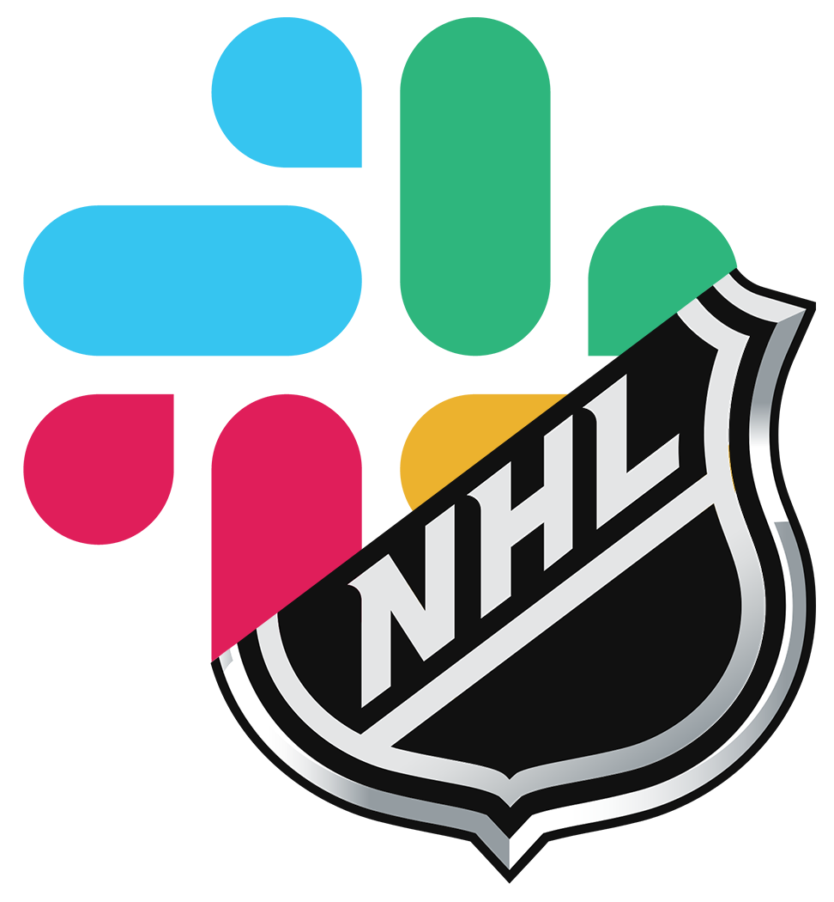

<!-- PROJECT HEADER -->
<br />
<p align="center">
  <a href="https://nhl.com">
    
  </a>

  <h2 align="center">NHL Slack Bot</h2>

  <p align="center">
    a Slack Bot for getting real-time scores & standing for your favorite NHL teams.
    <br />
    <br />
    <a href="https://github.com/tim-corley/nhl-slack-bot/issues">Report Bug</a>
  </p>
    <div align="center">
    <h3>Built with:<h3>
      <a href="https://github.com/nodejs/node">
    
  </a>
    <a href="https://api.slack.com/bot-users">
    
  </a>
  </div>
</p>

<!-- TABLE OF CONTENTS -->
<details>
  <summary>Table of Contents</summary>
  <ol>
    <li>
      <a href="#about-the-project">About The Project</a>
      <ul>
        <li><a href="#built-with">Built With</a></li>
      </ul>
    </li>
    <li>
      <a href="#getting-started">Getting Started</a>
      <ul>
        <li><a href="#prerequisites">Prerequisites</a></li>
        <li><a href="#installation">Installation</a></li>
        <li><a href="#usage">Usage</a></li>
      </ul>
    </li>
        <li>
      <a href="#dev-notes">Dev Notes</a>
      <ul>
        <li><a href="#api">API</a></li>
      </ul>
    </li>
    <li><a href="#license">License</a></li>
    <li><a href="#contact">Contact</a></li>
  </ol>
</details>

<!-- ABOUT THE PROJECT -->
## About The Project

[![Product Name Screen Shot][product-screenshot]](https://example.com)

This is a custom built slack bot that is meant to be used in a workspace to get hockey scores & standings.

### Built With

* [Node](https://github.com/nodejs/node)
* [Slack](https://api.slack.com/bot-users)

<!-- GETTING STARTED -->
## Getting Started

Follow the steps below to get a local development instance up & running.

### Prerequisites

Some things you'll need before on your machine in order to get going...

* node
  
  [Install Node](https://nodejs.org/en/download/) - or on macOS:
  ```sh
  brew install node
  ```
* npm
  ```sh
  npm install npm@latest -g
  ```
* a Slack workspace with admin access and an app created (see: https://api.slack.com/apps)

### Installation

1. Clone the repo
   ```sh
   git clone https://github.com/tim-corley/nhl-slack-bot.git
   ```
2. Install NPM packages
   ```sh
   npm install
   ```
3. create a `.env` file in the project root and add your Slack App Bot User OAuth Access Token (see: Slack API > Your Apps > *This App* > OAuth & Permissions > Bot User OAuth Access Token)
   ```
   BOT_USER_TOKEN=<my-access-token>
   ```
4. Start the development server
   ```sh
   node index.js
   ``` 
5. If everything is integrated correctly, you should see **bruins-bot** post a message to the `#general` channel in your workspace. Can also check your console for messages.

### Usage

the bot will respond with data when a message containing one of the following keywords is send in the channel: 
```
win
score
place
standings 
```

**Example**
```
tcorley  8:18 AM
what was the final score of the game last night?

bruins-bot  8:18 AM
✅ Bruins Won
Score: 3 - 2
Against: New Jersey Devils
Date: 01.15.2021
Record: 1-0-0 | 2pts
```

### Deployment

N/A

<!-- DEVELPOMENT NOTES -->
## Dev Notes

### API

This Slack Bot is using the `https://statsapi.web.nhl.com/api/v1` REST API to fetch current NHL data. Specifically, it uses the `/teams` & `/standings` endpoints. [API Documentation](https://github.com/dword4/nhlapi)

<!-- LICENSE -->
## License

Distributed under the MIT License. See `LICENSE` for more information.

<!-- CONTACT -->
## Contact

Tim Corley - [@tcor215](https://twitter.com/tcor215) - contact@tim-corley.dev

[product-screenshot]: img/screenshot.png